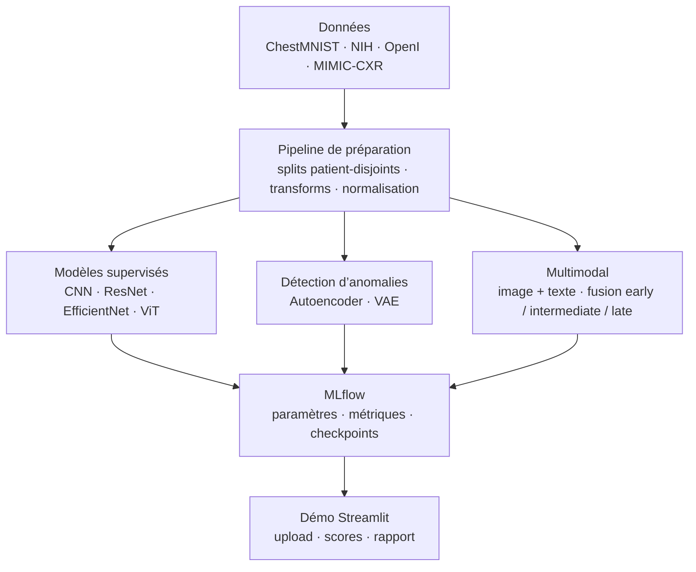

# Chest X-Ray Triage System

Système de triage de radiographies thoraciques basé sur le deep learning. Le projet regroupe la classification supervisée, la détection d’anomalies, la fusion image + texte, le suivi des expériences avec MLflow et une démonstration Streamlit.

## Architecture



## Stack

PyTorch · torchvision · timm · medmnist · scikit-learn · MLflow · Streamlit

## Installation

```bash
git clone https://github.com/Adam-Blf/chest-xray-triage-system.git
cd chest-xray-triage-system

python -m venv .venv
. .venv/Scripts/activate
pip install -r requirements.txt
```

## Démarrage rapide

```bash
python -m scripts.download_chestmnist --sizes 64
python -m scripts.train_all --smoke
mlflow ui --backend-store-uri mlruns
streamlit run app/streamlit_app.py
```

## Commandes utiles

```bash
python -m scripts.download_all
python -m src.train.train_cnn --epochs 10
python -m src.train.train_resnet --backbone resnet18 --epochs 10
python -m src.train.train_vit --backbone vit_tiny_patch16_224 --epochs 8
python -m src.train.train_ae --epochs 15
python -m src.train.train_vae --epochs 15 --beta 1.0
python -m src.train.train_multimodal --fusion late --epochs 8
```

## Structure

```text
src/        logique métier, modèles et entraînement
scripts/    téléchargement, EDA, rapport, orchestration
app/        démonstrateur Streamlit
docs/       documentation complémentaire
```

## Auteurs

- Adam Beloucif
- Emilien Morice
- Arnaud Dissongo

## Licence

MIT
